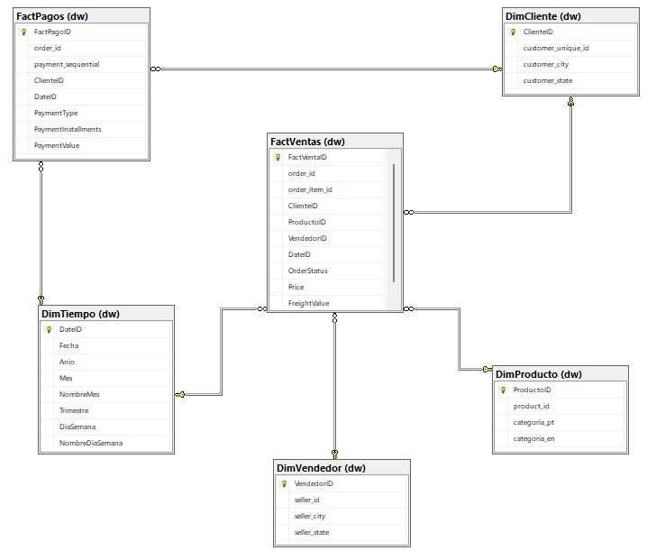
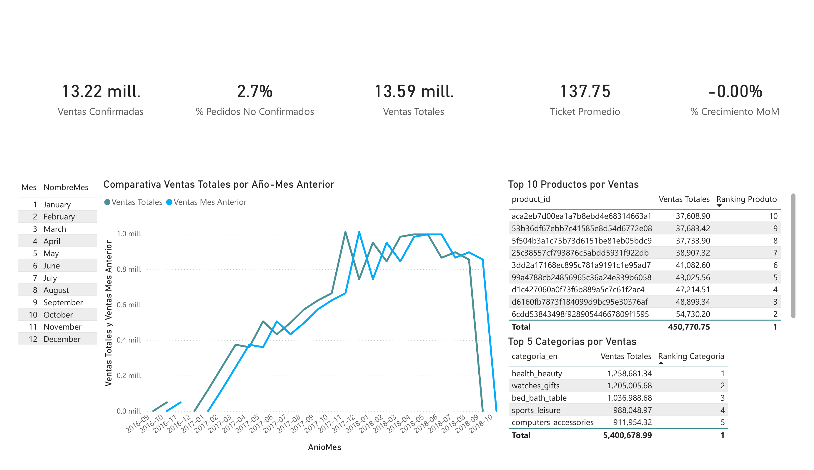
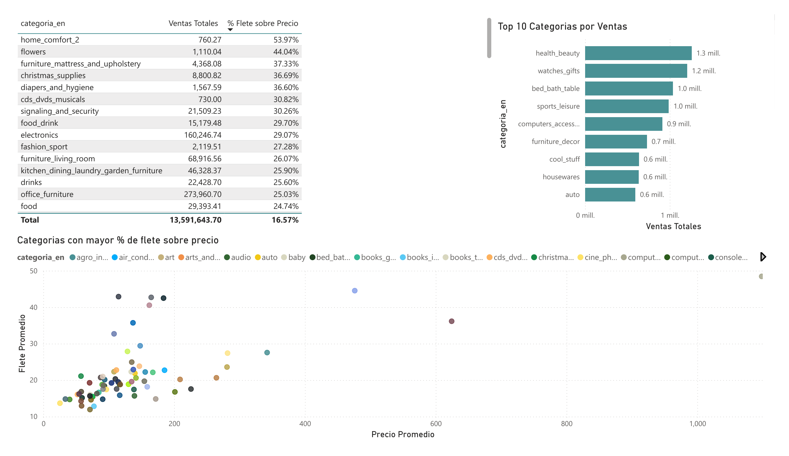
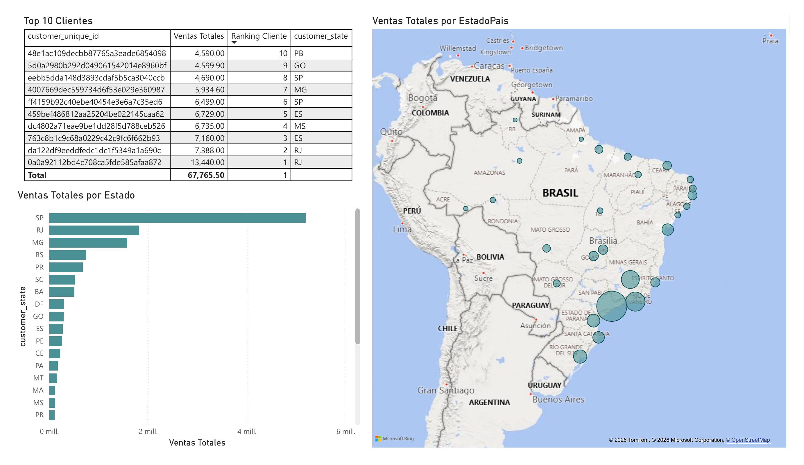

# Data Warehouse & Dashboard Ejecutivo de Ventas — Olist E-Commerce

Proyecto de portafolio: construcción de un Data Warehouse desde cero (ETL + modelo dimensional en SQL Server) sobre el dataset de e-commerce brasileño Olist, con el objetivo de responder preguntas de negocio de una empresa de retail/marketplace.

> **Estado del proyecto:** Data Warehouse completo (staging + modelo dimensional). Dashboard en Power BI.

---

## Problema de negocio

El dataset de Olist es un dataset relacional, con las inconsistencias típicas de un sistema transaccional, con llaves repetidas entre distintos niveles de grano, categorías sin traducir, clientes duplicados por múltiples compras, y pagos que no calzan 1 a 1 con las ventas. El objetivo fue transformarlo en un modelo analítico confiable, capaz de responder preguntas como:

- ¿Qué productos y categorías venden más?
- ¿Cómo varían las ventas en el tiempo (estacionalidad)?
- ¿Qué porcentaje de pedidos se cancela o no se entrega?
- ¿Cómo se comportan los pagos (tipo, cuotas) respecto a las ventas?

---

## Stack tecnológico

| Capa | Herramienta |
|---|---|
| Base de datos | SQL Server (motor local, Developer Edition) |
| ETL / carga | Python (`pandas`, `sqlalchemy`, `pyodbc`) |
| Modelado y transformación | T-SQL (window functions, CTEs recursivas, `COALESCE`) |
| Visualización | Power BI *(en progreso)* |

---

## Arquitectura del pipeline

```
CSV (Kaggle - Olist)
        │
        ▼
Python (pandas, dtype=str) ── carga cruda, sin transformar
        │
        ▼
staging.*  (SQL Server — 9 tablas espejo de los CSV, todo NVARCHAR)
        │
        ▼
T-SQL (limpieza, deduplicación, reglas de negocio)
        │
        ▼
dw.*  (modelo dimensional — 4 dimensiones + 2 tablas de hechos)
        │
        ▼
Power BI (modelado semántico + DAX + dashboard)
```

**Por qué una capa de staging separada:** cargar los CSV tal cual, sin transformar, antes de tocar el modelo final. Esto separa la fase de *extracción* de la fase de *transformación*, evitando errores tipo de dato en la carga masiva del dataset.

---

## Modelo dimensional



Opte por usar **Fact Constellation** (dos tablas de hechos a distinto grano, compartiendo dimensiones) en lugar de un único modelo estrella, por una razón concreta descubierta durante el análisis exploratorio. **El grano de "venta" (por ítem de pedido) y el grano de "pago" (por transacción de pago) no coinciden**, ya que un pedido puede tener varios ítems y, por separado, varias transacciones de pago (ej. tarjeta en cuotas + voucher), sin relación 1 a 1 entre ambos.

```
DimCliente ──┐                    ┌── DimTiempo
             ├── FactVentas ──────┤
DimProducto ─┤   (grano: item)    │
             │                    │
DimVendedor ─┘                    │
                                  │
             DimCliente ──────────┤
             FactPagos ───────────┘
             (grano: pago/pedido)
```

### Decisiones de diseño relevantes

- **Grano de `FactVentas` = order_item, no order.** Un pedido puede incluir varios productos de distintos vendedores; agregar a nivel de pedido habría impedido analizar por producto o por vendedor individual.
- **`FactVentas` incluye todos los `order_status` (no solo "delivered").** Permite responder preguntas como tasa de cancelación o ingreso potencial perdido por pedidos no entregados — no solo ventas ya concretadas. La distinción "ventas totales" vs. "ventas confirmadas" se resuelve en medidas DAX, no filtrando datos en el ETL.
- **Deduplicación de clientes.** `customer_id` identifica un **pedido**, no una persona; `customer_unique_id` es la llave real de cliente. Un mismo cliente puede tener ciudad/estado distintos entre compras, así que `DimCliente` se construyó quedándose con los datos de la compra más reciente por cliente, usando `ROW_NUMBER() OVER (PARTITION BY customer_unique_id ORDER BY fecha DESC)`.
- **Categorías de producto con fallback en cascada.** Aproximadamente 600 productos sin categoría y 2 categorías sin traducción al inglés se resolvieron con `COALESCE` de 3 niveles (traducción → nombre original en portugués → `'sem_categoria'`), evitando perder productos del análisis por datos incompletos.
- **`product_name` no existe en el dataset.** El dataset no expone nombres reales de producto, por lo que el análisis a nivel de producto se hace por `product_id` y categoría, una limitación documentada del dataset.
- **Llaves subrogadas (`INT IDENTITY`) en todas las dimensiones**, desacoplando el modelo de los IDs de negocio originales (strings muy largos) y siguiendo la práctica estándar de data warehousing.

---

## Dashboard Ejecutivo de Ventas (Power BI)

### Resumen Ejecutivo


### Análisis de Productos


### Análisis de Clientes y Geografía


## Respondiendo Preguntas de Negocio

### ¿Qué categorías venden más?

`health_beauty` ($1.26M), `watches_gifts` ($1.21M) y `bed_bath_table` ($1.04M) lideran, seguidas de `sports_leisure` ($988K) y `computers_accessories` ($912K). Estas 5 categorías concentran cerca del 40% de las ventas totales ($5.4M de $13.59M).

**Recomendación:** priorizar inventario y campañas de marketing en estas 5 categorías antes que dispersar presupuesto entre las ~70 categorías del catálogo — es donde ya existe demanda comprobada.

### ¿Hay estacionalidad en las ventas?

El gráfico de tendencia muestra crecimiento sostenido desde fines de 2016 hasta una meseta entre noviembre 2017 y mediados de 2018 (rondando $1.0M mensual). La caída hacia fines de 2018 corresponde a datos parciales del dataset (Olist no tiene el período completo cargado), no a una caída real del negocio.

**Limitación honesta:** con solo ~2 años de datos completos, no hay suficiente historia para confirmar un patrón estacional recurrente (ej. picos en diciembre por temporada de regalos) — se necesitarían 3+ años de datos para distinguir estacionalidad real de una tendencia de crecimiento del negocio.

### ¿Qué regiones concentran (y cuáles no) las ventas?

São Paulo (SP) domina de forma aplastante, seguido de Río de Janeiro (RJ) y Minas Gerais (MG). En el otro extremo, estados como Paraíba (PB), Maranhão (MA) y Mato Grosso do Sul (MS) representan una fracción mínima de las ventas totales.

**Recomendación:** SP/RJ/MG ya son el mercado core — tiene sentido optimizar logística (tiempos de entrega, costo de flete) ahí primero, donde el volumen justifica la inversión. Los estados de cola larga son candidatos para evaluar si vale la pena una estrategia de expansión activa o si conviene mantener operación pasiva.

### ¿Cómo impacta el costo de envío en la rentabilidad por categoría?

El flete representa en promedio un 16.57% del precio de venta a nivel global, pero varía enormemente por categoría: `home_comfort_2` (53.97%), `flowers` (44.04%) y `furniture_mattress_and_upholstery` (37.33%) tienen un costo de envío desproporcionado — probablemente por ser productos voluminosos o frágiles.

**Recomendación:** estas categorías son candidatas a revisar su estrategia de precio (¿el flete se está subsidiando de más?) o buscar negociación con transportistas especializados en carga voluminosa, ya que el costo logístico está erosionando buena parte del margen disponible.

### ¿Existe concentración de riesgo en clientes clave?

El cliente con mayor gasto histórico llega a $13,440 — una cifra baja en términos absolutos frente a $13.59M de ventas totales. Ningún cliente individual representa un porcentaje significativo del negocio.

**Recomendación:** esto es una buena noticia estructural — el negocio no depende de unos pocos "clientes ballena" que, si se van, arriesgan el negocio. La estrategia de retención debería enfocarse en el volumen de clientes recurrentes en general, no en cuentas específicas.

### ¿Qué porcentaje de las ventas está en riesgo por pedidos no confirmados?

2.7% de los $13.59M en ventas totales corresponde a pedidos que no llegaron a estado `delivered` (cancelados, no disponibles, etc.) — cerca de $370K de ingreso potencial no concretado.

**Recomendación:** aunque el porcentaje es bajo, vale la pena investigar *por qué categoría o por qué vendedor* se concentra ese 2.7%, ya que podría revelar un problema puntual (ej. un vendedor con alta tasa de cancelación) en vez de un problema distribuido de forma pareja.

### Limitación reconocida del análisis

El dataset no incluye costo de producto (COGS) — solo precio de venta y flete — por lo que **no es posible calcular utilidad o margen real por categoría**, solo ingresos brutos. Cualquier pregunta de "qué categorías pierden dinero" queda respondida de forma indirecta (a través del costo de flete relativo al precio), no como cálculo de rentabilidad real. Esta es una limitación del dataset público, no del diseño del modelo — y es importante declararla explícitamente en vez de aparentar una precisión que los datos no sostienen.

---

## Estructura del repositorio

```
olist-dw-project/
├── README.md
├── data/
│   └── raw/                      # CSV originales de Kaggle (no versionados — ver .gitignore)
├── sql/
│   ├── 01_staging_schema.sql     # creación de esquema y tablas staging
│   ├── 02_dw_schema.sql          # creación de esquema y tablas dw (dimensiones + hechos)
│   ├── 03_dim_tiempo.sql
│   ├── 04_dim_cliente.sql
│   ├── 05_dim_producto.sql
│   ├── 06_dim_vendedor.sql
│   ├── 07_fact_ventas.sql
│   └── 08_fact_pagos.sql
├── etl/
│   └── load_staging.py           # carga de CSV a staging con pandas + sqlalchemy
├── powerbi/
│   └── dashboard_ventas.pbix      # (pendiente)
└── docs/
    └── images/                    # capturas del dashboard, diagrama del modelo
```

---

## Cómo reproducirlo

1. Descargar el dataset ["Brazilian E-Commerce Public Dataset by Olist"](https://www.kaggle.com/) y descomprimir en `data/raw/`.
2. Crear la base de datos y ejecutar los scripts de `sql/` en orden (01 → 08).
3. Instalar dependencias: `pip install pandas pyodbc sqlalchemy`
4. Ejecutar `etl/load_staging.py` para cargar los CSV a `staging`.
5. Ejecutar los scripts de transformación (`03` a `08`) para poblar el modelo `dw`.

---

## Próximos pasos

- [x] Conectar Power BI a `dw.*` y modelar relaciones
- [x] Medidas DAX (ventas totales, ventas confirmadas, ticket promedio, rankings, time intelligence)
- [x] Dashboard ejecutivo con storytelling de negocio (3 páginas)
- [ ] Segunda iteración: incorporar analisis de fact_pagos (tipos de pago, cuotas).
